# Implementation Architecture

> Detailed architecture diagrams and implementation details for [`n8n-nodes-coinbase-cdp-agentkit`](https://www.npmjs.com/package/n8n-nodes-coinbase-cdp-agentkit). For installation and usage, see [README.md](README.md).

---

## Table of Contents

- [Package Architecture](#package-architecture)
- [Data Flow](#data-flow)
- [Source File Map](#source-file-map)
- [Credential Flow](#credential-flow)
- [Action Node Router](#action-node-router)
- [AI Agent Workflow](#ai-agent-workflow)
- [Tool Creation Flow](#tool-creation-flow)
- [Trigger Polling Mechanism](#trigger-polling-mechanism)
- [Triple-Pathway Usage](#triple-pathway-usage)
- [Example Workflow Diagrams](#example-workflow-diagrams)

---

## Package Architecture

AgentKit-first architecture: 3 focused nodes + 1 shared credential, designed to align with [Coinbase AgentKit](https://docs.cdp.coinbase.com/agent-kit/welcome) conventions while keeping the bundle lightweight by using [`@coinbase/cdp-sdk`](https://github.com/coinbase/cdp-sdk) directly.

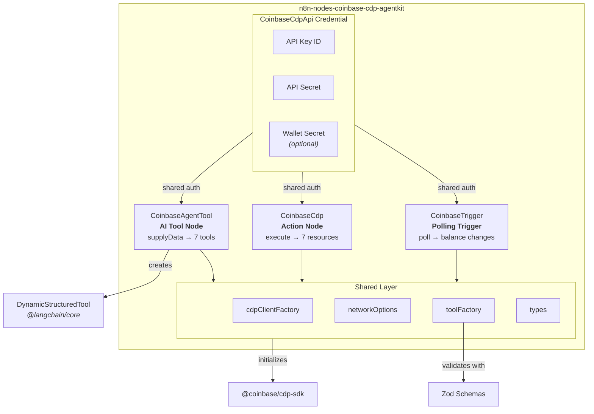

---

## Data Flow

How data flows between triggers, nodes, and AI agents:

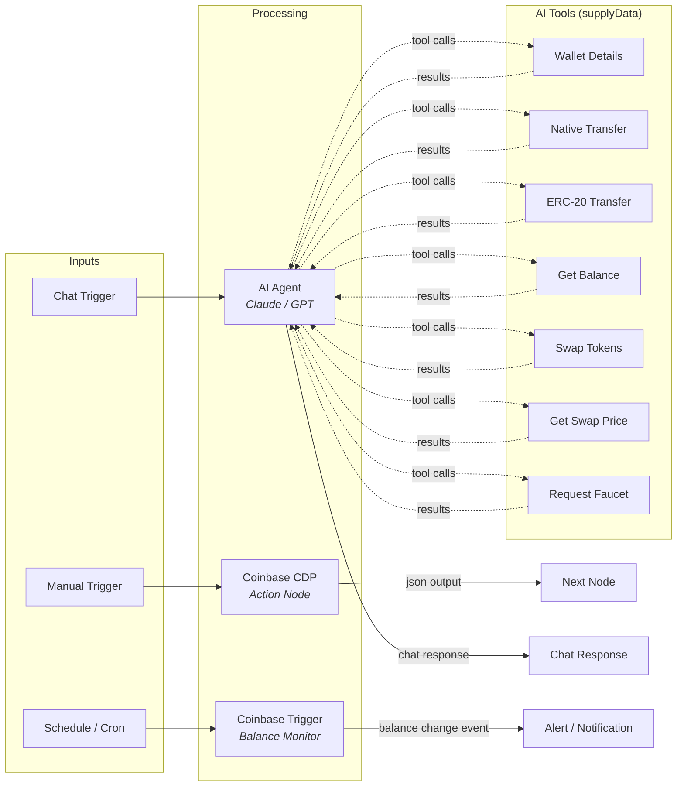

---

## Source File Map

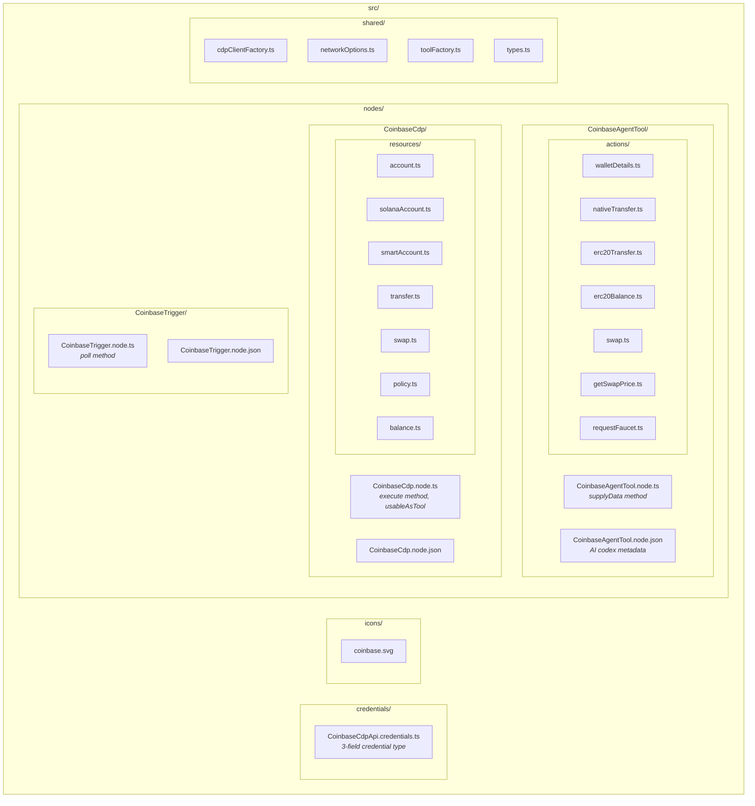

---

## Credential Flow

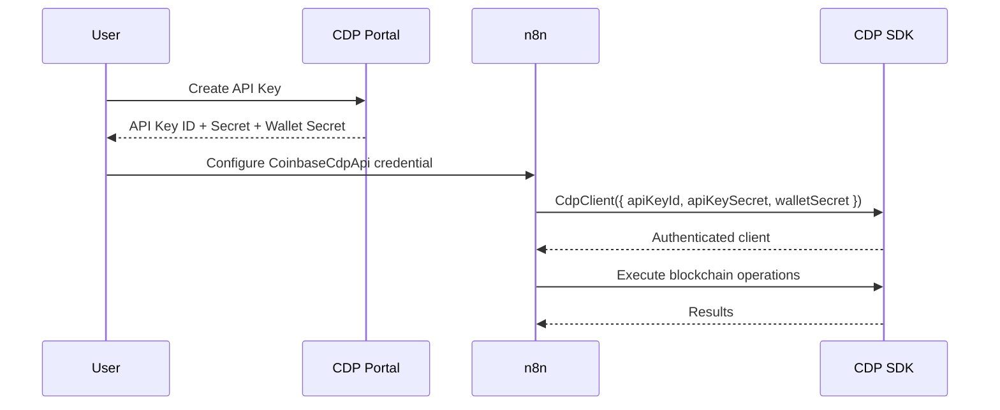

---

## Action Node Router

The `CoinbaseCdp` action node routes input items through a resource/operation pattern:

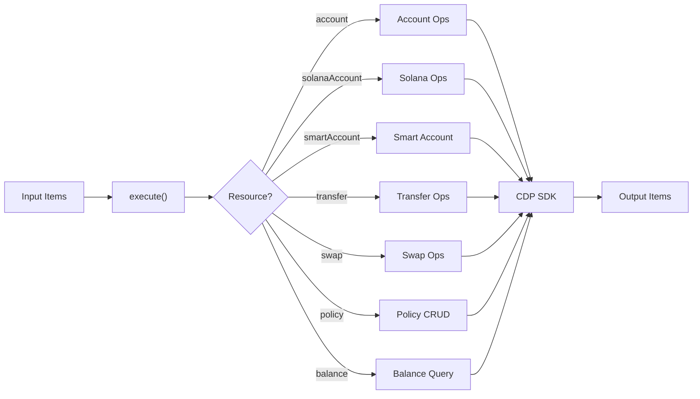

---

## AI Agent Workflow

The `CoinbaseAgentTool` node connects blockchain operations to n8n's AI Agent via LangChain `DynamicStructuredTool`:

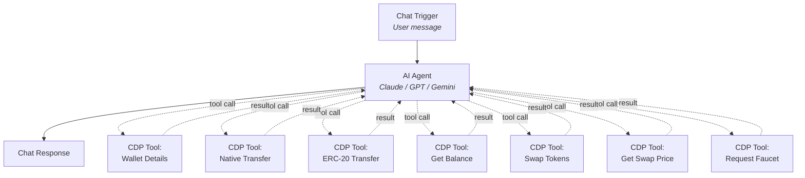

---

## Tool Creation Flow

How each AI tool is created and later invoked by the LLM:

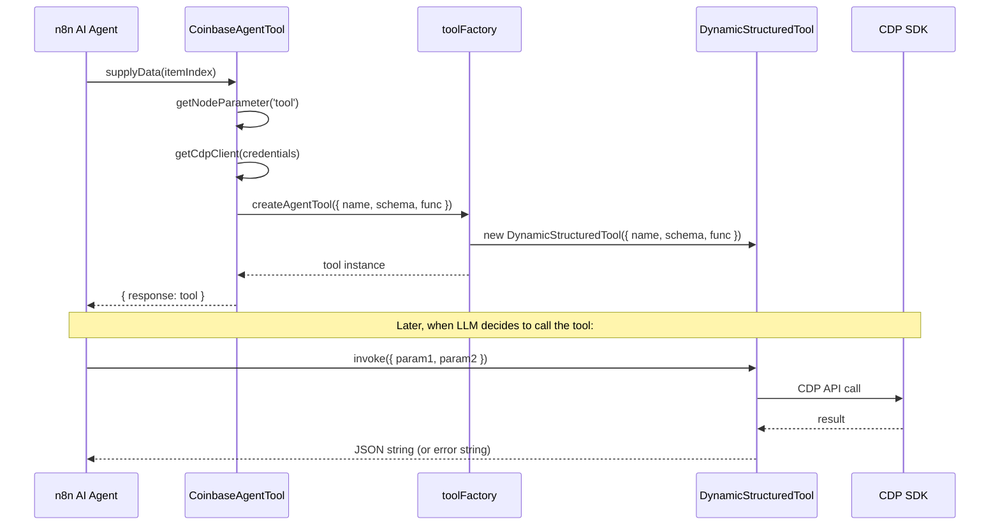

---

## Trigger Polling Mechanism

The `CoinbaseTrigger` uses n8n's polling mechanism with `staticData` persistence:

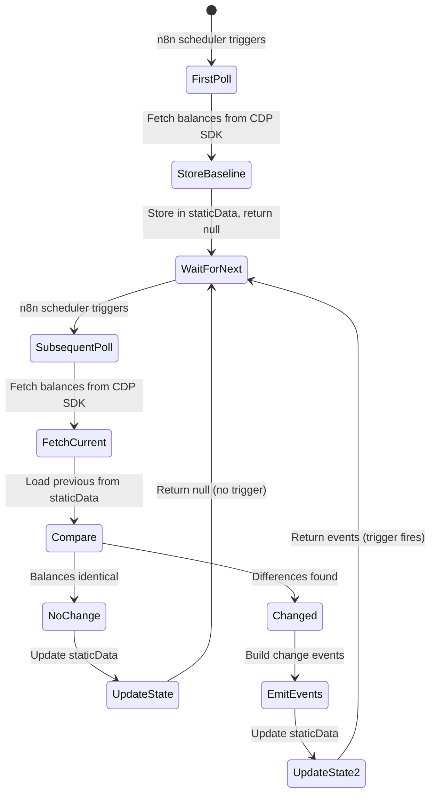

---

## Triple-Pathway Usage

The `CoinbaseCdp` action node sets `usableAsTool: true`, enabling three usage modes:

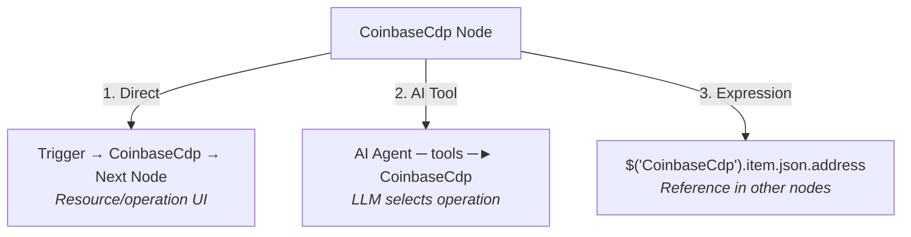

---

## Example Workflow Diagrams

### 1. Account & Balance Check

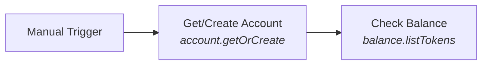

Create an EVM account on Base Sepolia and query its token balances.

### 2. Faucet & Transfer

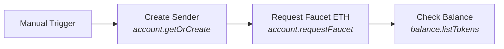

Request testnet ETH from the faucet and verify receipt.

### 3. Swap Tokens

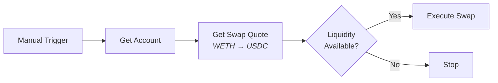

Quote a WETH→USDC swap on Base, check liquidity, execute if available.

### 4. AI Agent Blockchain

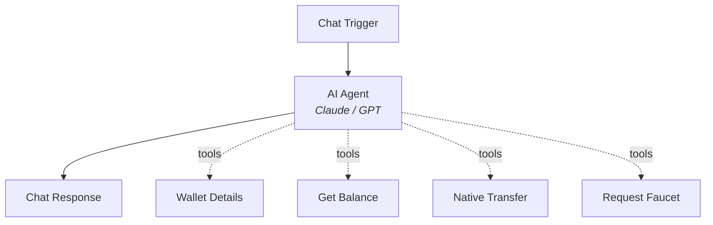

Chat-driven blockchain operations via LLM tool calling.

### 5. Balance Monitor

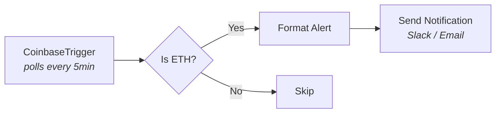

Event-driven balance monitoring with configurable alerts.

### 6. Multi-Chain Accounts

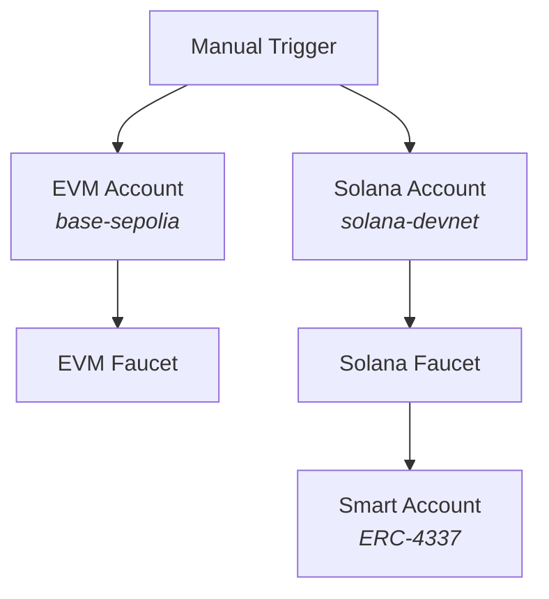

Parallel account creation across EVM and Solana with testnet funding.

### 7. Policy Management

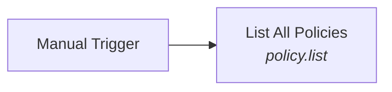

Query CDP governance policies for the organization.
