# n8n-nodes-coinbase-cdp

n8n community node package for [Coinbase Developer Platform (CDP)](https://docs.cdp.coinbase.com/). Create wallets, transfer tokens, swap assets, and build AI-powered blockchain agents — all from n8n workflows.

> **First AI agent + blockchain integration for any workflow automation platform.**

**3 nodes | 7 resources | 16 operations | 7 AI Agent tools | 12 networks | 100% test coverage**

[](https://www.npmjs.com/package/n8n-nodes-coinbase-cdp)
[](https://opensource.org/licenses/MIT)

---

## Table of Contents

- [Architecture](#architecture)
- [Installation](#installation)
- [Credentials](#credentials)
- [Nodes](#nodes)
  - [Coinbase CDP (Action Node)](#coinbase-cdp-action-node)
  - [Coinbase CDP Tool (AI Agent)](#coinbase-cdp-tool-ai-agent)
  - [Coinbase CDP Trigger](#coinbase-cdp-trigger)
- [Supported Networks](#supported-networks)
- [Example Workflows](#example-workflows)
- [Development](#development)
- [Design Decisions](#design-decisions)
- [Links & References](#links--references)
- [License](#license)

---

## Architecture

### AgentKit-First Strategy

This package uses an **AgentKit-first** architecture: 3 focused nodes + 1 shared credential, designed to align with [Coinbase AgentKit](https://docs.cdp.coinbase.com/agent-kit/welcome) conventions while keeping the bundle lightweight by using [`@coinbase/cdp-sdk`](https://github.com/coinbase/cdp-sdk) directly.

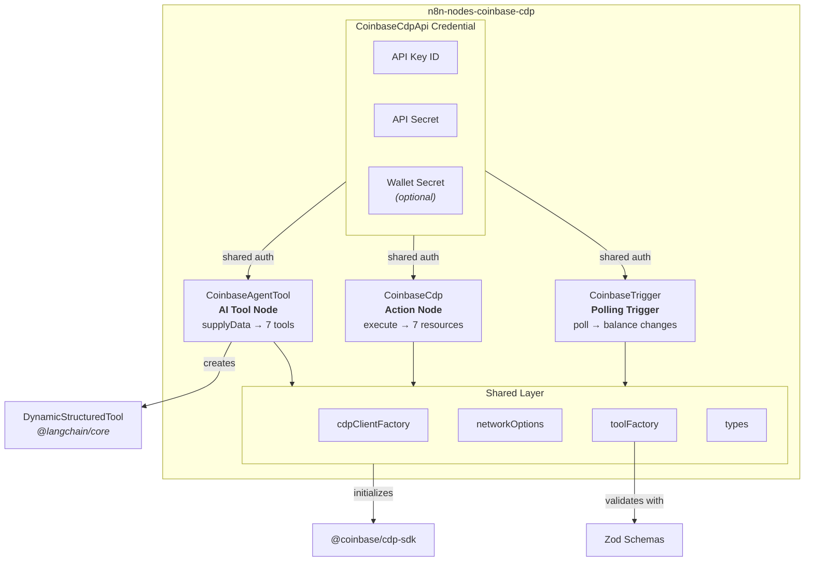

### Data Flow Between Nodes

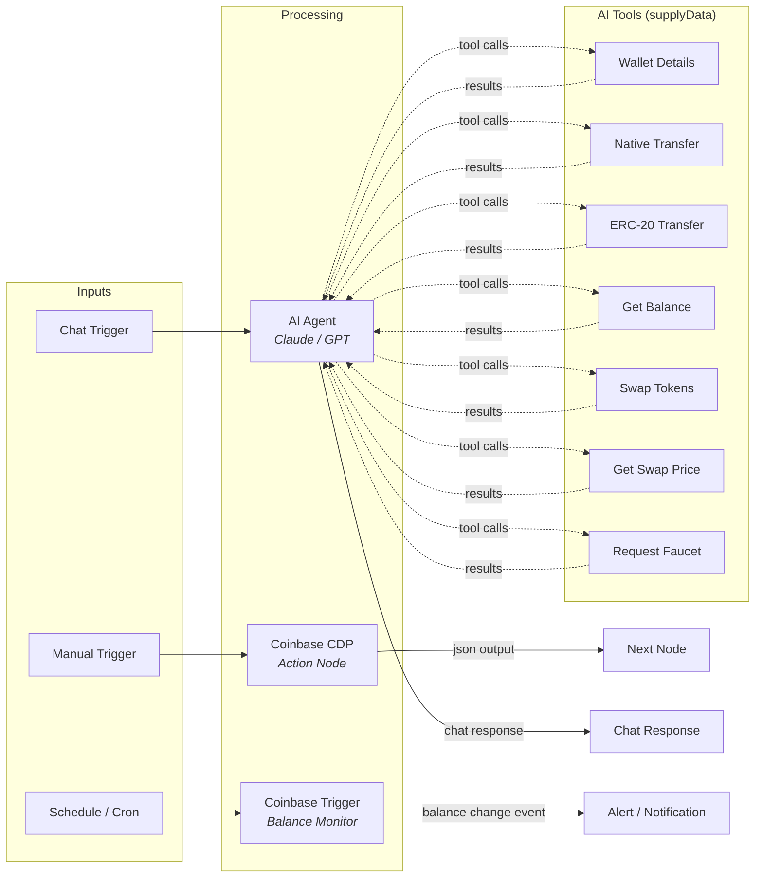

### Source File Map

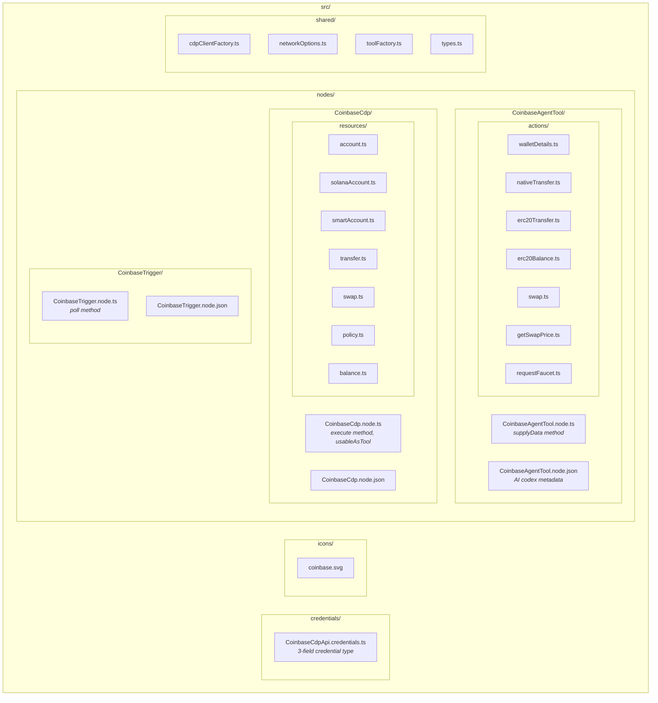

---

## Installation

### n8n Community Nodes (Recommended)

1. Go to **Settings > Community Nodes** in your n8n instance
2. Enter `n8n-nodes-coinbase-cdp`
3. Click **Install**

See the [n8n community nodes installation guide](https://docs.n8n.io/integrations/community-nodes/installation/gui-install/) for details.

### Manual Installation

```bash
cd ~/.n8n/custom
npm install n8n-nodes-coinbase-cdp
```

Restart n8n after installation. See [manual install docs](https://docs.n8n.io/integrations/community-nodes/installation/manual-install/).

---

## Credentials

You need a **Coinbase CDP API key** from the [CDP Portal](https://portal.cdp.coinbase.com/). See [CDP API Keys documentation](https://docs.cdp.coinbase.com/get-started/docs/cdp-api-keys) for details.

| Field | Required | Description |
|-------|----------|-------------|
| API Key ID | Yes | Your CDP API Key ID (UUID format) |
| API Key Secret | Yes | Your CDP API Key Secret (base64-encoded ES256 private key) |
| Wallet Secret | No | Required for signing transactions (transfers, swaps). Leave empty for read-only operations |

### Getting Your Credentials

1. Go to [portal.cdp.coinbase.com](https://portal.cdp.coinbase.com/)
2. Create a new project (or use an existing one)
3. Navigate to **API Keys** and create a new key
4. Copy the **API Key ID** and **API Key Secret**
5. For transaction signing, also copy the **Wallet Secret** from the key creation screen

> **Note**: The Wallet Secret is only shown once during key creation. If you lose it, you'll need to create a new API key.

### Credential Flow

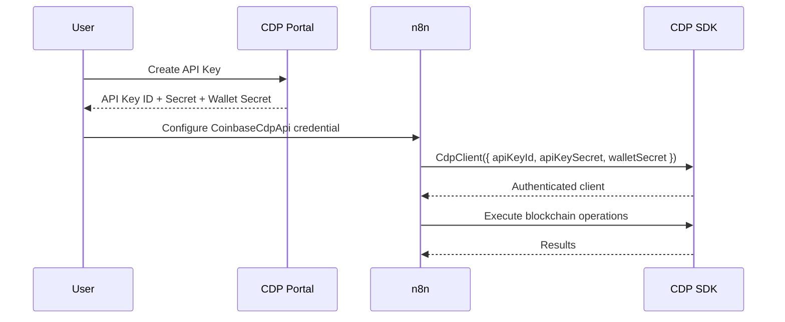

---

## Nodes

### Coinbase CDP (Action Node)

The primary node for deterministic blockchain operations. Processes items through a resource/operation pattern. Supports [`usableAsTool: true`](https://docs.n8n.io/integrations/creating-nodes/build/declarative-style-node/#usable-as-tool), so it can also be used directly as an AI Agent tool.

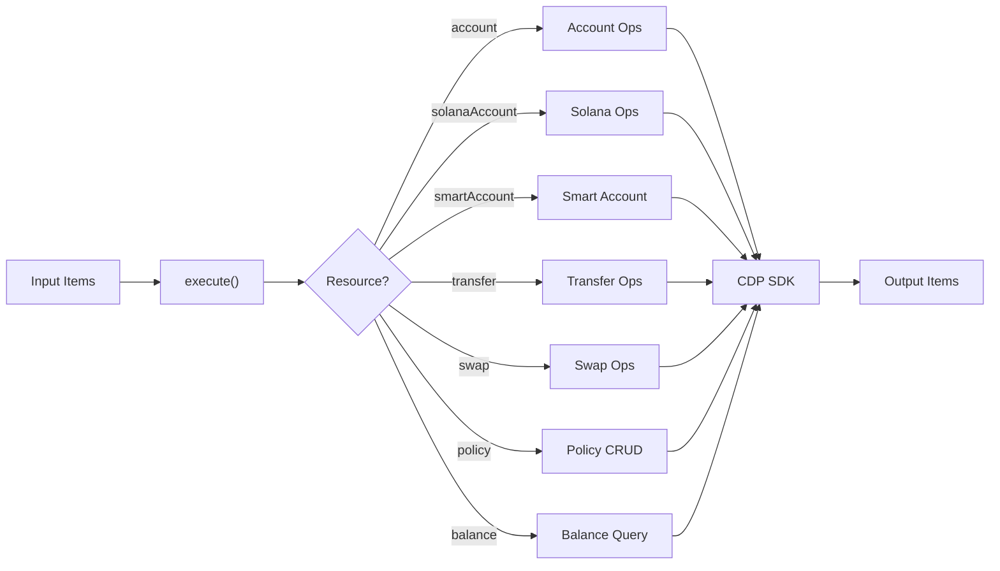

#### Resources & Operations

**Account** (EVM)

| Operation | Description | Key Parameters |
|-----------|-------------|----------------|
| Get or Create | Get existing or create new EVM account | `accountName` |
| List Balances | List all token balances for an address | `address`, `network` |
| Request Faucet | Request testnet tokens | `address`, `faucetNetwork`, `faucetToken` |

**Solana Account**

| Operation | Description | Key Parameters |
|-----------|-------------|----------------|
| Get or Create | Get or create a Solana account | `accountName` |
| Request Faucet | Request Solana devnet tokens | `address`, `faucetToken` |

**Smart Account**

| Operation | Description | Key Parameters |
|-----------|-------------|----------------|
| Get or Create | Create an ERC-4337 smart account | `ownerAccountName`, `smartAccountName` |

**Transfer**

| Operation | Description | Key Parameters |
|-----------|-------------|----------------|
| Send Native Token | Transfer ETH, MATIC, AVAX, etc. | `accountName`, `to`, `amount`, `network` |
| Send ERC-20 Token | Transfer USDC, DAI, or any ERC-20 | `accountName`, `to`, `amount`, `token`, `network` |

**Swap** (Base & Ethereum only)

| Operation | Description | Key Parameters |
|-----------|-------------|----------------|
| Execute Swap | Swap tokens via DEX | `accountName`, `fromToken`, `toToken`, `fromAmount`, `network` |
| Get Quote | Get swap quote without executing | `accountName`, `fromToken`, `toToken`, `fromAmount`, `network` |

**Policy** (see [CDP Policy docs](https://docs.cdp.coinbase.com/cdp-apis/docs/welcome))

| Operation | Description | Key Parameters |
|-----------|-------------|----------------|
| List | List all policies | — |
| Get | Get a policy by ID | `policyId` |
| Create | Create a new policy | `policyJson` |
| Update | Update a policy | `policyId`, `policyJson` |
| Delete | Delete a policy | `policyId` |

**Balance**

| Operation | Description | Key Parameters |
|-----------|-------------|----------------|
| List Token Balances | List all token balances for an address | `address`, `network` |

---

### Coinbase CDP Tool (AI Agent)

Connect blockchain operations to n8n's AI Agent node. Each tool is a [LangChain `DynamicStructuredTool`](https://v03.api.js.langchain.com/classes/_langchain_core.tools.DynamicStructuredTool.html) that an LLM can invoke autonomously. Tool names and schemas are compatible with [Coinbase AgentKit](https://docs.cdp.coinbase.com/agent-kit/welcome) conventions.

#### AI Agent Workflow

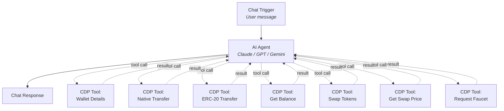

#### Available Tools

| Tool | LangChain Name | Zod Schema | Description |
|------|---------------|------------|-------------|
| Get Wallet Details | `get_wallet_details` | `{ name: string }` | Get or create an EVM account, return address |
| Native Transfer | `native_transfer` | `{ accountName, to, amount, network }` | Transfer ETH/native tokens to an address |
| ERC-20 Transfer | `erc20_transfer` | `{ accountName, to, amount, token, network }` | Transfer ERC-20 tokens (USDC, DAI, etc.) |
| Get Balance | `get_balance` | `{ address, token, network }` | Check token balance for any wallet address |
| Swap Tokens | `swap_tokens` | `{ accountName, fromToken, toToken, fromAmount, network }` | Swap one token for another on Base/Ethereum |
| Get Swap Price | `get_swap_price` | `{ accountName, fromToken, toToken, fromAmount, network }` | Get price quote without executing |
| Request Faucet | `request_faucet` | `{ address, token, network }` | Request testnet tokens (ETH, USDC, SOL) |

#### Tool Creation Flow

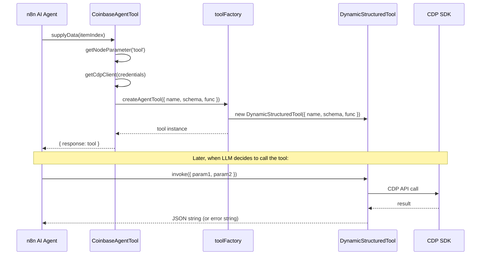

#### AI Agent Setup

1. Add a **Chat Trigger** node
2. Add an **AI Agent** node with your preferred LLM (OpenAI, Anthropic, etc.)
3. Add **Coinbase CDP Tool** nodes for each capability you want the agent to have
4. Connect the CDP Tool nodes to the AI Agent's `ai_tool` input
5. The LLM will decide when and how to use each tool based on the conversation

---

### Coinbase CDP Trigger

Polls for balance changes on any EVM address. Fires when any token balance increases, decreases, or a new token appears.

#### Polling Mechanism

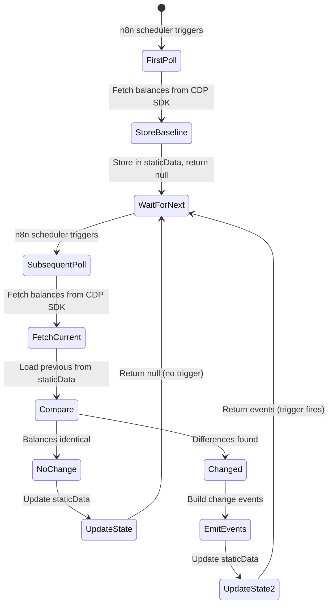

#### Configuration

| Parameter | Description |
|-----------|-------------|
| Event | `Balance Changed` — triggers on any token balance change |
| Address | The EVM wallet address to monitor (`0x...`) |
| Network | Which network to monitor (any of the 12 supported networks) |

#### Output Format

Each trigger event contains:

```json
{
  "address": "0x1234...abcd",
  "network": "base-sepolia",
  "token": "ETH",
  "previousBalance": "1000000000000000000",
  "currentBalance": "2000000000000000000",
  "timestamp": "2026-01-15T10:30:00.000Z"
}
```

The trigger stores the last known balances in n8n's workflow static data and compares on each poll. The first poll captures a baseline without triggering.

---

## Supported Networks

| Network | Chain | Transfer | Swap | Faucet |
|---------|-------|:---:|:---:|:---:|
| Base | EVM | Yes | Yes | — |
| Base Sepolia | EVM | Yes | — | Yes |
| Ethereum | EVM | Yes | Yes | — |
| Ethereum Sepolia | EVM | Yes | — | Yes |
| Ethereum Holesky | EVM | Yes | — | Yes |
| Polygon | EVM | Yes | — | — |
| Arbitrum | EVM | Yes | — | — |
| Optimism | EVM | Yes | — | — |
| Avalanche C-Chain | EVM | Yes | — | — |
| BNB Chain | EVM | Yes | — | — |
| Solana Mainnet | Solana | Yes | — | — |
| Solana Devnet | Solana | Yes | — | Yes |

See the [CDP SDK documentation](https://docs.cdp.coinbase.com/get-started/docs/use-sdks) for the latest network support.

---

## Example Workflows

Import these from the `examples/` directory into your n8n instance.

### 1. Account & Balance Check

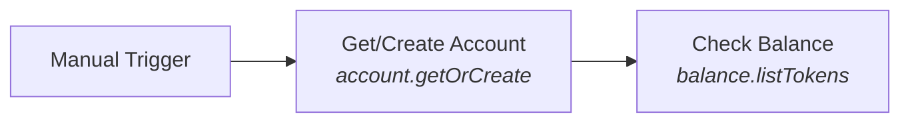

Create an EVM account on Base Sepolia and query its token balances.

### 2. Faucet & Transfer

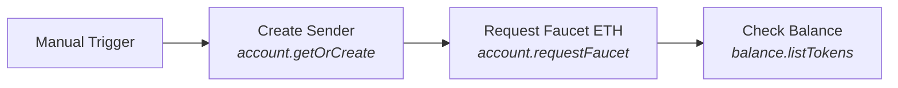

Request testnet ETH from the faucet and verify receipt.

### 3. Swap Tokens

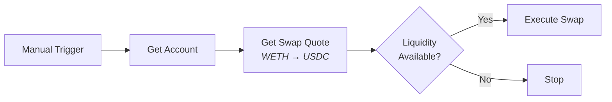

Quote a WETH→USDC swap on Base, check liquidity, execute if available.

### 4. AI Agent Blockchain

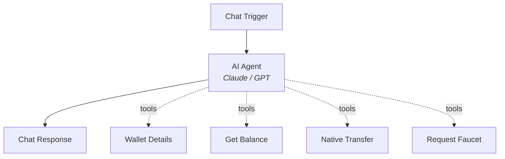

Chat-driven blockchain operations via LLM tool calling.

### 5. Balance Monitor

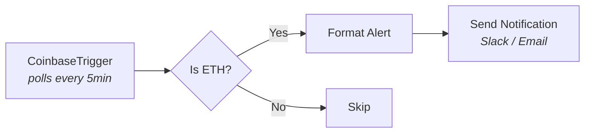

Event-driven balance monitoring with configurable alerts.

### 6. Multi-Chain Accounts

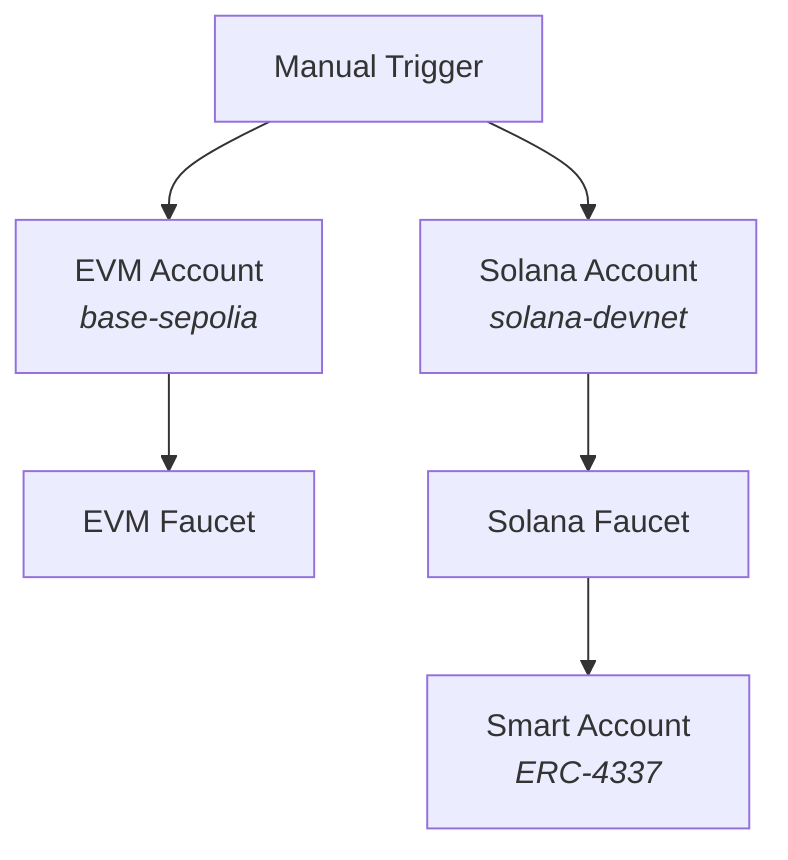

Parallel account creation across EVM and Solana with testnet funding.

### 7. Policy Management

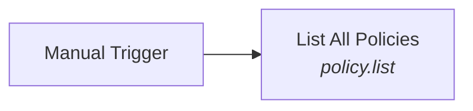

Query CDP governance policies for the organization.

---

## Development

### Prerequisites

- Node.js 22+ (required by [`@coinbase/cdp-sdk`](https://github.com/coinbase/cdp-sdk))
- npm

### Setup

```bash
git clone https://github.com/pvdyck/n8n-nodes-coinbase-cdp
cd n8n-nodes-coinbase-cdp
npm install
```

### Development Server

```bash
npm run dev
```

Uses [`@n8n/node-cli`](https://www.npmjs.com/package/@n8n/node-cli) to symlink the package into n8n's custom extensions, run the TypeScript compiler in watch mode, and start n8n with hot reload. Open `http://localhost:5678` to access the editor.

### Scripts

| Command | Description |
|---------|-------------|
| `npm run build` | Compile TypeScript + copy icons (`tsc && gulp build:icons`) |
| `npm test` | Run all 116 unit tests |
| `npm run test:coverage` | Run with coverage report (100% across all metrics) |
| `npm run test:watch` | Run in watch mode |
| `npm run test:e2e` | Run E2E workflows against live n8n (requires `.env` + running n8n) |
| `npm run test:all` | Unit tests + E2E combined |
| `npm run lint` | ESLint check |
| `npm run lint:fix` | ESLint auto-fix |

### Environment Variables

Copy `.env.example` to `.env` for E2E testing:

```bash
cp .env.example .env
```

```
CDP_API_KEY_ID=your-key-id
CDP_API_KEY_SECRET=your-key-secret
CDP_WALLET_SECRET=your-wallet-secret
```

### Test Coverage

116 tests across 8 suites with **100% coverage** on all metrics:

```
---------------------------------|---------|----------|---------|---------|
File                             | % Stmts | % Branch | % Funcs | % Lines |
---------------------------------|---------|----------|---------|---------|
All files                        |     100 |      100 |     100 |     100 |
---------------------------------|---------|----------|---------|---------|
```

| Suite | Tests | Covers |
|-------|:-----:|--------|
| CoinbaseAgentTool.test.ts | 30 | All 7 AI tool actions, error handling, edge cases |
| CoinbaseAgentToolNode.test.ts | 10 | `supplyData` integration, tool invocation, metadata |
| CoinbaseCdp.test.ts | 35 | All 7 resource operations, error branches, fallbacks |
| CoinbaseCdpNode.test.ts | 15 | `execute()`, `continueOnFail`, multi-item, unknown resource |
| CoinbaseTrigger.test.ts | 14 | Polling, balance change detection, null fallbacks |
| toolFactory.test.ts | 4 | Error wrapper (Error, string, object throws) |
| cdpClientFactory.test.ts | 3 | Client creation with/without walletSecret |
| credentials.test.ts | 5 | Credential metadata validation |

### E2E Tests

Run against a live n8n instance with real CDP credentials:

| Workflow | Result | What it validates |
|----------|:------:|---|
| account-and-balance | PASS | Account creation + balance query on Base Sepolia |
| faucet-and-transfer | PASS | Faucet request + balance verification |
| multi-chain-accounts | PASS | Parallel EVM + Solana account creation |
| policy-management | PASS | Policy listing via CDP API |
| ai-agent-blockchain | VALID | Structure validation (needs AI model) |
| balance-monitor | VALID | Structure validation (needs trigger activation) |
| swap-tokens | VALID | Structure validation (needs funded wallet) |

---

## Design Decisions

### AgentKit-Compatible Without the Dependency

Tool names (`get_wallet_details`, `native_transfer`, etc.) and schemas match [Coinbase AgentKit](https://github.com/coinbase/agentkit) conventions, but we use [`@coinbase/cdp-sdk`](https://github.com/coinbase/cdp-sdk) directly. This gives a 10x lighter bundle while staying compatible with AgentKit tutorials and documentation.

### Triple-Pathway Usage via `usableAsTool`

The `CoinbaseCdp` action node sets `usableAsTool: true`, enabling three usage modes:

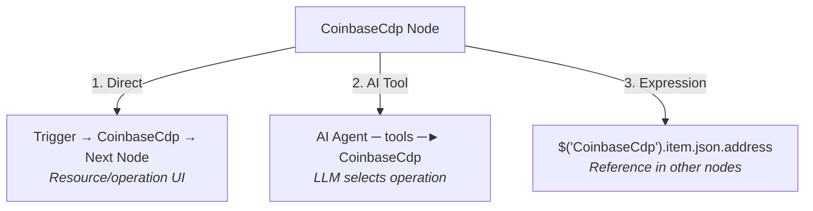

### Error-Safe Agent Tools

The [`toolFactory`](src/shared/toolFactory.ts) wraps every tool function in try/catch, returning error messages as strings instead of throwing. This allows the LLM to recover gracefully and try alternative approaches.

### Polling Trigger with Static Data

n8n supports polling natively. The [`@coinbase/cdp-sdk`](https://github.com/coinbase/cdp-sdk) doesn't expose WebSocket balance streams, so polling with n8n's `getWorkflowStaticData('node')` persistence is the pragmatic choice. The first poll stores a baseline; subsequent polls compare and emit change events.

### `DynamicStructuredTool` with `any` Typed Schema

Complex Zod schemas trigger TypeScript error TS2589 (deep instantiation) in LangChain's type system. Typing the schema as `any` in the `ToolDefinition` interface avoids this while keeping runtime validation intact via Zod.

---

## Links & References

### Coinbase Developer Platform

| Resource | URL |
|----------|-----|
| CDP Documentation | [docs.cdp.coinbase.com](https://docs.cdp.coinbase.com/) |
| CDP Portal (API Keys) | [portal.cdp.coinbase.com](https://portal.cdp.coinbase.com/) |
| CDP API Keys Guide | [docs.cdp.coinbase.com/get-started/docs/cdp-api-keys](https://docs.cdp.coinbase.com/get-started/docs/cdp-api-keys) |
| CDP SDK Guide | [docs.cdp.coinbase.com/get-started/docs/use-sdks](https://docs.cdp.coinbase.com/get-started/docs/use-sdks) |
| CDP API Reference | [docs.cdp.coinbase.com/cdp-apis/docs/welcome](https://docs.cdp.coinbase.com/cdp-apis/docs/welcome) |
| AgentKit Documentation | [docs.cdp.coinbase.com/agent-kit/welcome](https://docs.cdp.coinbase.com/agent-kit/welcome) |

### GitHub Repositories

| Repository | URL |
|------------|-----|
| CDP SDK (TypeScript/Python) | [github.com/coinbase/cdp-sdk](https://github.com/coinbase/cdp-sdk) |
| AgentKit | [github.com/coinbase/agentkit](https://github.com/coinbase/agentkit) |
| This Package | [github.com/pvdyck/n8n-nodes-coinbase-cdp](https://github.com/pvdyck/n8n-nodes-coinbase-cdp) |

### n8n

| Resource | URL |
|----------|-----|
| Community Nodes Install (GUI) | [docs.n8n.io/integrations/community-nodes/installation/gui-install](https://docs.n8n.io/integrations/community-nodes/installation/gui-install/) |
| Community Nodes Install (Manual) | [docs.n8n.io/integrations/community-nodes/installation/manual-install](https://docs.n8n.io/integrations/community-nodes/installation/manual-install/) |
| Creating Nodes Guide | [docs.n8n.io/integrations/creating-nodes](https://docs.n8n.io/integrations/creating-nodes/) |

### Dependencies

| Package | Version | Purpose | Docs |
|---------|---------|---------|------|
| [`@coinbase/cdp-sdk`](https://www.npmjs.com/package/@coinbase/cdp-sdk) | ^1.44.0 | CDP SDK v2 — blockchain operations | [GitHub](https://github.com/coinbase/cdp-sdk) |
| [`@langchain/core`](https://www.npmjs.com/package/@langchain/core) | ^0.3.0 | `DynamicStructuredTool` for AI Agent integration | [API Docs](https://v03.api.js.langchain.com/classes/_langchain_core.tools.DynamicStructuredTool.html) |
| [`zod`](https://www.npmjs.com/package/zod) | ^3.24.0 | Schema validation for tool parameters | [zod.dev](https://zod.dev) |
| [`n8n-workflow`](https://www.npmjs.com/package/n8n-workflow) | * (peer) | n8n node interfaces | [n8n docs](https://docs.n8n.io/) |

---

## License

[MIT](LICENSE)
